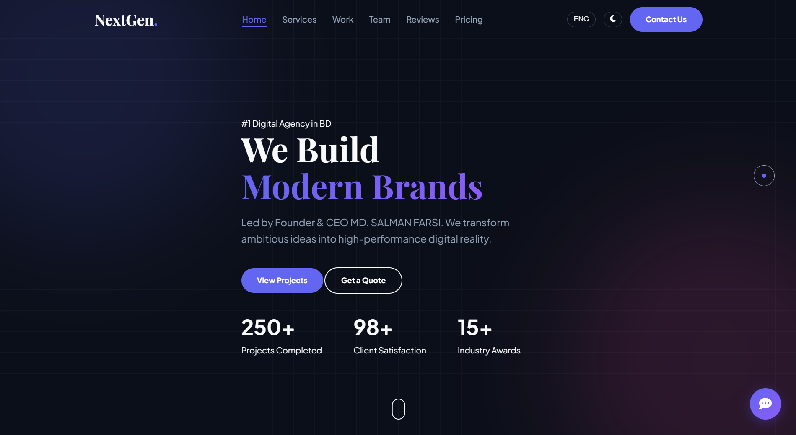

# NextGen | Premium Digital Agency Website 🚀



A high-performance, fully responsive, and bilingual (English/Bangla) portfolio website designed for **NextGen**, a modern digital agency in Bangladesh. This project features a **Serverless Backend** (via Google Sheets), a **Smart AI Chatbot**, and a premium **"Glassmorphism" UI**.

## 🔗 Live Demo
### [👉 Click here to view the Live Site](https://salmansync.github.io/NextGenAgency/)

---

## 🌟 Key Features

* **🇧🇩 Bilingual Engine:** Instant **English to Bangla** translation for all content with a single click.
* **🤖 Smart AI Chatbot:** A built-in virtual assistant that answers questions about services, pricing, and the team instantly.
* **📊 Google Sheets Integration:**
    * **Contact Form:** Submissions are sent directly to a Google Sheet (No server needed!).
    * **Review System:** Clients can submit feedback via a popup modal, which is also stored automatically.
* **🌓 Dark/Light Mode:** Professional theme toggler with persistent memory (saves user preference).
* **🎨 Modern UI/UX:**
    * **Physics Cursor:** Lag-free magnetic cursor with a dot-and-ring system.
    * **Glassmorphism:** Premium blur effects on cards, modals, and forms.
    * **3D Tilt Effects:** Interactive hover effects on portfolio and service cards.
    * **Typing Animation:** Dynamic text animation in the Hero section.
* **📱 Fully Responsive:** Optimized for Desktop, Tablet, and Mobile devices with a custom mobile menu.
* **⚡ High Performance:** Built with Vanilla JS (zero dependencies) and includes a custom **Preloader**.

## 🛠️ Tech Stack

* **HTML5:** Semantic markup for accessibility and SEO.
* **CSS3:** CSS Variables, Flexbox, Grid, and complex Keyframe Animations.
* **JavaScript (ES6+):** Logic for translations, theme toggling, form handling, and scroll observers.
* **Google Apps Script:** Acts as the backend API to connect HTML forms with Google Sheets.
* **FontAwesome:** For social and interface icons.
* **Google Fonts:** *Plus Jakarta Sans* (English Body), *Playfair Display* (Headings), *Hind Siliguri* (Bangla).

  👥 The Squad
The project highlights the leadership team behind NextGen:

👑 Md. Salman Farsi - Founder & CEO

💻 Md. Mahidul Islam - Lead Developer

📝 Sumaiya - Content Strategist

⚙️ Hasan Reza - QA Lead

🎨 Md. Sifat Molla - Design Director

🚀 Setup & Usage
Clone the repository:

Bash

git clone [https://github.com/salmansync/NextGenAgency.git](https://github.com/salmansync/NextGenAgency.git)
Open index.html in your browser or use Live Server in VS Code.

For Google Sheets Integration:

Create a new Google Sheet.

Add headers in Row 1: Name, Email, Message, Client_Name, Client_Role, Feedback.

Open Extensions > Apps Script in the sheet.

Paste the setup script and deploy as a Web App (Access: Anyone).

Update the scriptURL and reviewScriptURL in your script.js file with the new Web App URL.

📄 License
This project is licensed under the MIT License.

<p align="center">
Made with ❤️ by <b>NextGen Team</b>
</p>

## 📂 Folder Structure

```text
NextGen-Agency/
│
├── index.html          # Main HTML structure
├── style.css           # All styles, themes, and animations
├── script.js           # Logic (Chatbot, Translations, Forms, Cursor)
├── README.md           # Project Documentation
└── images/             # Assets Folder
    ├── salman.jpg
    ├── sumaiya.jpg
    ├── mahidul.jpg
    ├── hasan.jpg
    ├── sifat.jpg
    ├── work-1.png
    ├── work-2.png
    └── work-3.png


    
